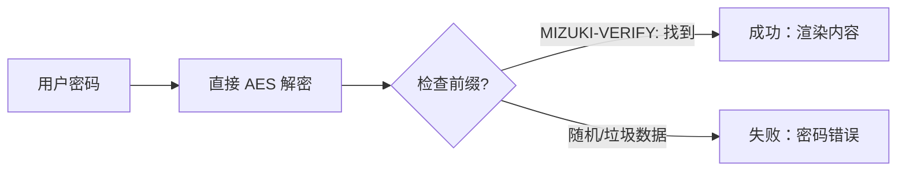

本博客模板基于 [Astro](https://astro.build/) 构建。本指南未提及的内容，您可以在 [Astro 文档](https://docs.astro.build/) 中找到答案。

## 文章的前置元数据

```yaml
---
title: 我的第一篇博客文章
published: 2023-09-09
description: 这是我的新 Astro 博客的第一篇文章。
image: ./cover.jpg
tags: [Foo, Bar]
category: Front-end
draft: false
---
```

| 属性           | 描述                                                                                                                                                                                                  |
|----------------|-------------------------------------------------------------------------------------------------------------------------------------------------------------------------------------------------------|
| `title`        | 文章标题。                                                                                                                                                                                            |
| `published`    | 文章发布日期。                                                                                                                                                                                        |
| `pinned`       | 是否将此文章固定在文章列表顶部。                                                                                                                                                                      |
| `description`  | 文章的简短描述，显示在首页。                                                                                                                                                                          |
| `image`        | 文章封面图片路径。<br/>1. 以 `http://` 或 `https://` 开头：使用网络图片<br/>2. 以 `/` 开头：表示 `public` 目录下的图片<br/>3. 无上述前缀：相对于 Markdown 文件的路径                                  |
| `tags`         | 文章标签。                                                                                                                                                                                            |
| `category`     | 文章分类。                                                                                                                                                                                            |
| `alias`        | 文章的别名。文章将通过 `/posts/{alias}/` 访问。例如：`my-special-article`（可通过 `/posts/my-special-article/` 访问）                                                                              |
| `licenseName`  | 文章内容的许可证名称。                                                                                                                                                                                |
| `author`       | 文章作者。                                                                                                                                                                                            |
| `sourceLink`   | 文章内容的来源链接或参考来源。                                                                                                                                                                        |
| `draft`        | 若为 `true`，表示文章仍为草稿，不会显示。                                                                                                                                                             |
| `encrypted`    | 是否对文章进行密码保护。                                                                                                                                                                              |
| `password`     | 用于解锁加密文章的密码。                                                                                                                                                                              |
| `passwordHint` | 帮助用户记忆密码的提示，显示在密码输入框下方。                                                                                                                                                        |
| `hideHomeContent` | 是否隐藏公开的文章摘要，包括首页、元标签、Feed/API摘要以及分享预览。当设置了 `password` 时，默认值为 `true`。                                                                                 |

## 文章文件存放位置

您的文章文件应放在 `src/content/posts/` 目录下。您也可以创建子目录，以便更好地组织文章和资源。

```
src/content/posts/
├── post-1.md
└── post-2/
    ├── cover.png
    └── index.md
```

## 文章别名

您可以通过在前置元数据中添加 `alias` 字段来为任何文章设置别名：

```yaml
---
title: 我的特别文章
published: 2024-01-15
alias: "my-special-article"
tags: ["Example"]
category: "Technology"
---
```

设置别名后：
- 文章可通过自定义 URL 访问（例如 `/posts/my-special-article/`）
- 默认的 `/posts/{slug}/` URL 仍然有效
- RSS/Atom 订阅将使用自定义别名
- 所有内部链接将自动使用自定义别名

**重要说明：**
- 别名不应包含 `/posts/` 前缀（会自动添加）
- 避免在别名中使用特殊字符和空格
- 为获得最佳 SEO 效果，请使用小写字母和连字符
- 确保所有文章的别名唯一
- 不要包含前导或尾随斜杠

## 工作原理



## 页面加密

您可以通过在前置元数据中设置 `encrypted: true` 并提供 `password` 来对任何文章进行密码保护：

```yaml
---
title: 我的私密文章
published: 2024-01-15
encrypted: true
password: "my-secret-password"
passwordHint: "提示：密码是我狗的名字"
hideHomeContent: true
---
```

### 字段说明

| 字段              | 是否必须 | 描述                                                                                   |
|-------------------|----------|----------------------------------------------------------------------------------------|
| `encrypted`       | 是       | 设置为 `true` 以启用密码保护                                                           |
| `password`        | 是       | 用于解锁文章的密码                                                                     |
| `passwordHint`    | 否       | 显示在密码输入框下方的提示，帮助用户回忆密码                                            |
| `hideHomeContent` | 否       | 是否隐藏公开摘要，替换为「该文章已加密」。当设置了 `password` 时，默认值为 `true`。设置为 `false` 可显示正常摘要。 |

### 解锁框的样式

解锁框会显示：
- 一个主题色的锁图标
- 文章标题「密码保护」
- 要求输入密码的说明
- 提示（如果提供了 `passwordHint`）
- 密码输入框和解锁按钮

输入正确密码后，内容会被解密并显示。密码会保存在会话存储中，因此用户在同一会话内无需在后续页面加载时重新输入。
